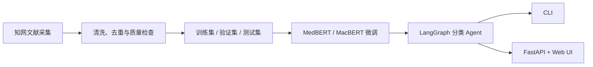

# 医学文献智能分类系统

面向《中国图书馆分类法》（CLC）R 类医学文献的端到端分类项目。系统覆盖知网文献采集、数据清洗与分层划分、中文预训练模型微调与评估、LangGraph 分类工作流、FastAPI 服务和可视化前端，可接收医学文本或 TXT、PDF、DOCX 文档并返回 Top-K 分类候选、置信度状态与完整执行步骤。

## 项目概览



主要特性：

- 覆盖 CLC 医学类目，统一维护类别编码、名称和模型标签映射；
- 支持纯文本、结构化论文信息以及 TXT、PDF、DOCX 文件；
- 使用 LangGraph 编排输入校验、文档解析、文本预处理、模型推理、候选选择和结果生成；
- 对低置信度结果展示多个候选，不将不确定预测伪装为确定结论；
- 在线推理与离线采集、清洗、训练解耦，服务启动不会隐式训练模型；
- 提供数据质量报告、模型指标、混淆矩阵和可追踪的步骤日志；
- 测试默认不依赖 GPU、知网访问或真实模型权重。

## 当前数据与模型

仓库中已提交的数据报告和测试集评估结果如下：

| 项目 | 数值 |
| --- | ---: |
| 清洗后样本数 | 5,450 |
| 有效分类数 | 110 |
| 训练 / 验证 / 测试集 | 3,811 / 547 / 1,092 |
| MedBERT 测试集 Accuracy | 71.06% |
| MedBERT 测试集 Macro-F1 | 70.36% |
| MacBERT 测试集 Accuracy | 70.24% |
| MacBERT 测试集 Macro-F1 | 69.68% |

这些数值来自 `data/processed/*.json` 和 `results/*_test_metrics.json`。当前数据标签源自采集检索条件，属于弱标签；指标只代表仓库中对应数据划分和 checkpoint 的离线结果。

## 环境要求

- Python 3.10 或更高版本；
- 仅运行演示与自动测试时不需要 GPU；
- 运行真实模型建议使用 CUDA 环境，CPU 也可推理但速度较慢；
- 文献采集需要 Chrome、可用的知网访问环境，并可能需要人工处理验证码。

## 快速开始

### 1. 创建环境并安装依赖

Windows PowerShell：

```powershell
python -m venv .venv
.\.venv\Scripts\Activate.ps1
python -m pip install --upgrade pip
pip install -r requirements.txt
```

Linux / macOS：

```bash
python -m venv .venv
source .venv/bin/activate
python -m pip install --upgrade pip
pip install -r requirements.txt
```

`requirements.txt` 安装 Agent 核心和 Web 服务。按用途安装额外依赖：

```bash
# 加载真实模型
pip install -r requirements-model.txt

# 数据采集、训练和评估所需的完整离线依赖
pip install -r requirements-offline.txt

# 开发与测试工具
pip install -e ".[dev]"
```

### 2. 无模型快速体验

演示分类器使用固定关键词规则，只用于验证工作流与接口，不代表真实模型效果：

```bash
python -m agent --demo --text "患者反复胸痛，冠状动脉造影提示血管狭窄。"
python -m agent --demo --file examples/sample.txt --steps
python -m agent --demo --paper-json examples/sample_paper.json
```

也可以在安装项目后使用命令行入口：

```bash
academic-agent --demo --text "高血压患者的长期用药管理研究"
```

### 3. 使用真实 MedBERT 模型

默认真实模型目录为 `model/checkpoints/medbert_v20/best`。该目录需要包含模型权重、Tokenizer、`labels.json` 和 `training_config.json`。

```bash
python -m agent --team \
  --checkpoint model/checkpoints/medbert_v20/best \
  --device cpu \
  --text "糖尿病患者发生视网膜病变的危险因素分析"
```

在 PowerShell 中可将上述命令写成一行，或使用反引号换行。省略 `--checkpoint` 时会读取默认目录；省略 `--device` 时由 PyTorch 自动选择可用设备。

### 4. 启动 Web 服务

Web 服务默认加载真实 MedBERT checkpoint：

```bash
python -m backend.main
```

打开 <http://127.0.0.1:8000> 使用已构建的前端，打开 <http://127.0.0.1:8000/docs> 查看交互式 API 文档。默认监听 `0.0.0.0:8000`，可在 `config.py` 的 `WEB_CONFIG` 中修改。

> 如果真实 checkpoint 不存在，基础健康检查仍可返回成功，但实际分类以及 `GET /api/health?check_model=true` 会报告模型未就绪。

## CLI 用法

输入方式必须选择一个：

| 参数 | 说明 |
| --- | --- |
| `--text TEXT` | 直接分类文本 |
| `--file PATH` | 分类 TXT、PDF 或 DOCX 文件 |
| `--paper-json PATH` | 分类含 `title`、`keywords`、`abstract` 的 JSON |
| `--stdin` | 从标准输入读取文本 |
| `--graph` | 输出 Mermaid 工作流图 |

运行模式必须选择一个：

| 参数 | 说明 |
| --- | --- |
| `--demo` | 使用内置关键词演示分类器 |
| `--team` | 使用项目内 MedBERT 集成 |
| `--config PATH` | 使用自定义 Python 或脚本模型适配配置 |

常用选项包括 `--top-k`、`--confidence-threshold`、`--steps` 和 `--trace-file`。例如：

```bash
Get-Content examples/sample.txt | python -m agent --demo --stdin --top-k 3
python -m agent --demo --graph
python -m agent --demo --text "肺部影像学检查" --trace-file logs/agent.jsonl
```

自定义模型可参考 `config/model.python.example.json` 和 `config/model.script.example.json`。详细适配协议见 `docs/integration.md`。

## HTTP API

| 方法 | 路径 | 功能 |
| --- | --- | --- |
| `GET` | `/api/health` | 服务健康检查；传 `check_model=true` 可检查真实模型 |
| `POST` | `/api/classify` | 对文本进行分类 |
| `POST` | `/api/classify/stream` | 以 SSE 返回文本分类步骤与结果 |
| `POST` | `/api/classify/file` | 上传并分类 TXT、PDF 或 DOCX，最大 10 MiB |
| `POST` | `/api/classify/file/stream` | 以 SSE 返回文件解析与分类进度 |
| `POST` | `/api/agent/run` | 通用 Agent 调用入口 |
| `GET` | `/api/statistics` | 返回数据集与清洗统计 |
| `GET` | `/api/metrics` | 返回已保存的模型指标与混淆矩阵 |

文本分类示例：

```bash
curl -X POST http://127.0.0.1:8000/api/classify \
  -H "Content-Type: application/json" \
  -d '{"text":"冠心病患者介入治疗后的预后分析","top_k":5}'
```

上传文件示例：

```bash
curl -X POST "http://127.0.0.1:8000/api/classify/file?top_k=5" \
  -F "file=@examples/sample.txt"
```

返回结果包含首选分类、Top-K 候选、置信度状态、模型信息、输入摘要、警告及各工作流步骤。服务不会在结果中保存或回传原始文档正文。

## 数据处理

仓库已包含处理后的数据。如需从 `data/raw/R*.jsonl` 重新生成数据集：

```bash
python run_preprocess.py
python -m preprocess.validate
```

默认按 70% / 10% / 20% 分层划分训练集、验证集和测试集，并使用固定随机种子 42。可选配置示例：

```bash
python run_preprocess.py \
  --raw-dir data/raw \
  --val-size 0.1 \
  --test-size 0.2 \
  --balance class_weight \
  --random-state 42
```

主要输出：

- `data/processed/cleaned.jsonl`：清洗去重后的标准数据；
- `data/train.jsonl`、`data/val.jsonl`、`data/test.jsonl`：模型数据集；
- `data/labels.json`：标签 ID、类别名称和类别权重；
- `data/processed/quality_report.json`：数据质量与拒绝原因统计；
- `data/processed/statistics.json`：类别及文本长度统计；
- `data/processed/validation_report.json`：结构、版本和数据泄漏检查结果。

更完整的数据约定与导入流程见 `preprocess/README.md`。

## 模型训练与评估

训练前请先安装离线依赖，并准备本地预训练模型或允许 Transformers 下载模型。训练会保存验证集 Macro-F1 最佳的 checkpoint。

```bash
python -m model.train \
  --model-type medbert \
  --model-path model/pretrained/medbert-base-chinese \
  --epochs 20 \
  --batch-size 8 \
  --output-name medbert_v20 \
  --device cuda
```

支持的 `--model-type` 为 `medbert`、`macbert` 和 `qwen_embedding`。显存不足时可减小 `--batch-size`，并通过 `--grad-accumulation` 保持有效批量大小。类别不平衡实验可增加 `--use-class-weights`。

评估已有 checkpoint：

```bash
python -m model.evaluate \
  --model-type medbert \
  --checkpoint model/checkpoints/medbert_v20/best \
  --test-file data/test.jsonl \
  --device cuda \
  --output-name medbert_v20
```

单独调用模型推理：

```bash
python -m model.classifier \
  --checkpoint model/checkpoints/medbert_v20/best \
  --text "慢性肾病患者的临床特征与治疗效果" \
  --top-k 5
```

## 文献采集（可选）

采集模块通过 Selenium 访问知网。请遵守目标网站服务条款、访问控制和数据使用规范，并控制请求频率。由于知网可能检测无头浏览器，建议使用可见浏览器运行。

```bash
# 列出全部配置类目
python run_crawl.py --list

# 快速测试：采集 R51 类 5 条记录
python run_crawl.py --test

# 指定类目与每类上限
python run_crawl.py --cats R51 R52 R54 --limit 30

# 仅采集列表页基础字段
python run_crawl.py --cats R51 --limit 30 --no-detail
```

采集结果默认按类目写入 `data/raw/R*.jsonl`，并生成合并文件。采集页面结构或登录状态变化时，需要更新 `crawler/` 中的解析逻辑或浏览器会话。

## 离线流水线编排

`academic-pipeline` 只执行明确请求的离线阶段，并检查约定产物；在线请求不会触发采集或训练。配置结构可参考 `config/pipeline.example.json`：

```bash
academic-pipeline --config config/pipeline.example.json --prepare-data --train-if-missing
```

示例配置展示的是通用脚本协议，接入前应将其中命令和产物路径改为实际可执行入口。

## 测试与代码检查

```bash
pytest
ruff check .
```

默认测试使用模拟模型和临时文件。若本地已有完整的约 409 MB MedBERT checkpoint，可显式运行真实模型冒烟测试：

PowerShell：

```powershell
$env:ACADEMIC_REAL_MODEL_TESTS = "1"
pytest -m real_model
```

Linux / macOS：

```bash
ACADEMIC_REAL_MODEL_TESTS=1 pytest -m real_model
```

## 项目结构

```text
.
├── agent/          # LangGraph 工作流、工具、模型适配器与统一结果协议
├── backend/        # FastAPI 接口、SSE 流式响应与静态前端入口
├── crawler/        # 知网采集与 CLC 类目处理
├── preprocess/     # 清洗、去重、划分、统计和数据验收
├── model/          # 模型训练、加载、推理、评估及 checkpoint
├── frontend/dist/  # 已构建的 Web 前端静态文件
├── data/           # 原始数据、处理结果、数据划分与标签映射
├── results/        # 训练历史、测试指标与混淆矩阵数据
├── config/         # 模型适配与离线流水线示例配置
├── docs/           # 接口协议、实现说明和 JSON Schema
├── examples/       # CLI、模型脚本和后端集成示例
├── tests/          # 单元测试、集成测试与真实模型冒烟测试
├── run_crawl.py    # 数据采集入口
└── run_preprocess.py # 数据处理入口
```

## 设计说明与限制

- 当前 Agent 是确定性的工具工作流，没有调用外部 LLM，也不需要 API Key；
- PDF 依赖文本层提取，扫描版 PDF 未集成 OCR；
- 文件上传限制为 10 MiB，支持 TXT、PDF 和 DOCX；
- 默认模型置信度阈值为 0.6，低置信度结果应由人工结合候选类别复核；
- `model/checkpoints/` 默认被 Git 忽略，部署时需单独准备完整 checkpoint；
- 分类结果用于文献组织与实验演示，不应替代医学诊断或临床决策。

## 进一步阅读

- `docs/integration.md`：Agent、模型和后端的集成协议；
- `docs/implementation.md`：工作流与模型适配层实现说明；
- `docs/member5-integration.md`：Web 后端使用的 ToolResult 协议；
- `preprocess/DATASET_REPORT_2026-09-03.md`：数据集构建报告；
- `docs/validation.md`：项目验证说明。
